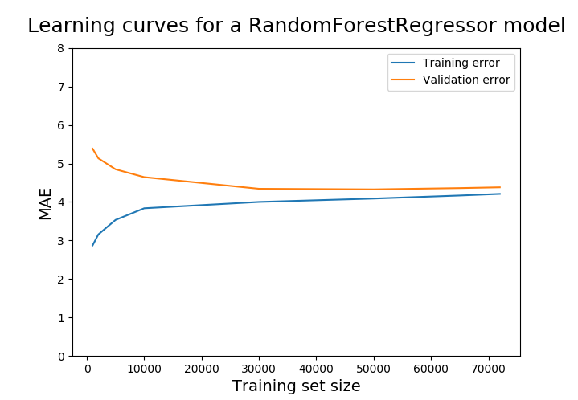

# Food-Preparation-Time
Predicting food preparation time from ordered food items and quantity. This is a data challenge arranged by SkipTheDishes, Canada's leading and largest food delivery company. The data included upto 10 ordered food items along with the quantity. The goal is to predict food preparation time.

# Dataset info
The data included 20 features and 80,000 samples. Please check Data-Challenge-Skipthedishes-Repaired.pdf for details.

# Applied techniques
• Doc2Vec and Label Encoder have been applied to vectorize food item names and feature engineering. 
• RandomForest is used to predict food preparation time. 
• Grid search is used for hyperparameter optimization. 

# Result 
• The baseline performance is R2: 0.61, MAE: 5.45, RMSE: 6.98. The performance achieved with doc2Vec is R2:0.75, MAE: 4.41, RMSE: 5.56 and the performance acheved with Label Encoder is R2: 0.70, MAE: 4.86, RMSE 6.08. The details can be found in performance.csv.

# Learning Curve

# How to Run
Check Food_preparation_time_rf.py and Food_preparation_time_rf_doc2Vec.py